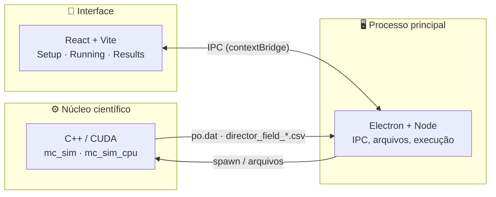

<div align="center">

<picture>
  <source media="(prefers-color-scheme: dark)" srcset="apps/desktop/renderer/src/assets/logo-dark.png">
  
</picture>

### Simulador de Monte Carlo para Cristais Líquidos

Um ambiente desktop completo — física, computação de alto desempenho e visualização científica —
para simular, explorar e entender sistemas de cristais líquidos nemáticos.

[](https://github.com/kamakawa)

[](#-como-rodar-localmente)
[](#-tecnologias)
[](#-internacionalização)
[](#-tecnologias)
[](#-tecnologias)

**[Funcionalidades](#-funcionalidades)** ·
**[Arquitetura](#-arquitetura)** ·
**[Como rodar](#-como-rodar-localmente)**

</div>

<br>

## 🔬 Sobre o projeto

**McLiCS** (*Monte Carlo simulator for Liquid Crystal Systems*) é um software científico que simula
a física de cristais líquidos nemáticos em rede, usando métodos de **Monte Carlo** e **minimização de
energia**. Ele nasceu como projeto de **Iniciação Científica** e cresceu para um ambiente completo:
configurar uma simulação, rodá-la em CPU ou GPU, acompanhar sua execução ao vivo, e explorar os
resultados — inclusive a rede de diretores inteira em **3D**, interativamente — tudo em um único app.

Cristais líquidos ocupam o espaço entre líquidos comuns e sólidos cristalinos, e são a base de
tecnologias como displays (LCD) e sensores ópticos. O McLiCS modela esse comportamento em nível
microscópico — orientação molecular, parâmetro de ordem, transições de fase — e traduz os resultados
em algo que se pode literalmente girar na tela e entender.

<br>

## ⚙️ Funcionalidades

| | |
|---|---|
| 🧊 **Visualização 3D interativa** | O campo diretor completo renderizado em WebGL — órbita, zoom, cortes por plano, destaque automático de defeitos e uma linha do tempo para assistir a rede evoluir ao longo da simulação. |
| ⚡ **CPU e GPU** | O mesmo modelo físico compilado para rodar tanto em CPU (OpenMP) quanto em GPU (CUDA), com um clique. |
| 📊 **Análise automática** | Resumo executivo gerado a partir do `po.dat` — médias, extremos e estimativa de transição de fase — além dos gráficos completos de S(T) e E(T) com faixa de incerteza. |
| 📁 **Organização por execução** | Cada simulação vira uma pasta própria, com todos os arquivos, snapshots e parâmetros preservados. |
| 📝 **Notas + relatório em PDF** | Anotações do pesquisador exportadas junto com gráficos e parâmetros em um relatório pronto para compartilhar. |
| 🌍 **Multilíngue** | Interface completa em 6 idiomas: Português, Inglês, Espanhol, Francês, Japonês e Chinês. |
| 🌙 **Modo escuro/claro** | Tema adaptado em todas as telas, incluindo a própria visualização 3D. |
| 🧭 **Guia de parâmetros embutido** | Explicação de cada parâmetro físico direto no formulário, sem precisar sair do app. |

<br>

## 🧬 Sobre a física

O McLiCS trabalha com um modelo de rede (*lattice model*) onde cada sítio guarda um **diretor**
molecular. A evolução do sistema segue **mecânica estatística** via Monte Carlo, sob diferentes
potenciais de interação e geometrias:

- **Potenciais:** Lebwohl–Lasher, GHRL (elástico generalizado) e Selinger/Pear
- **Geometrias:** bulk, slab, esfera e geometrias customizadas via arquivo de contorno
- **Ancoragem de superfície:** homeotrópica, planar e variantes acopladas ao GHRL
- **Modos de evolução:** variação térmica, degraus de temperatura, *quench* e campo elétrico

Grandezas analisadas: **parâmetro de ordem (S)**, **energia (E)**, **temperatura** e **transições de
fase** — tudo exportado em `po.dat` e nos snapshots `director_field_*.csv` que alimentam a
visualização 3D.

<br>

## 🏗️ Arquitetura

Três camadas independentes, cada uma fazendo só o que faz de melhor:



O backend não sabe nada sobre interface — ele só lê um `param.txt` e escreve `.dat`/`.csv`. O processo
principal do Electron orquestra a execução e faz a ponte segura com o sistema de arquivos. O
renderer nunca toca em disco ou processos diretamente: tudo passa pela API exposta via
`contextBridge`, com verificação de caminho em toda leitura de arquivo.

<br>

## 🧱 Tecnologias

<table>
<tr>
<td valign="top">

**Núcleo científico**
<p>


</p>
GSL · OpenMP · Makefile

</td>
<td valign="top">

**Desktop**
<p>


</p>
electron-builder · IPC seguro (contextBridge)

</td>
<td valign="top">

**Interface**
<p>


</p>
React Router · Three.js (WebGL) · CSS custom properties

</td>
</tr>
</table>

<br>

## 🚀 Como rodar localmente

### Pré-requisitos

- **Node.js** 20.19+ (ou 22.12+) — exigido pelo Vite 7
- **g++** e **GNU Make**
- **GSL** (`libgsl-dev`) e **OpenMP** — para o núcleo científico
- **CUDA Toolkit** (`nvcc`) — opcional, só para o build de GPU; sem ele o Makefile cai para CPU automaticamente

### Passo a passo

```bash
# 1. Clonar o repositório
git clone https://github.com/kamakawa/McLiCS.git
cd McLiCS

# 2. Compilar o núcleo científico (gera mc_sim_cpu e, se houver nvcc, mc_sim)
cd backend
make          # build de GPU (cai para CPU se não houver nvcc)
make CPU      # build explícito de CPU
cd ..

# 3. Instalar e rodar a interface (renderer)
cd apps/desktop/renderer
npm install
npm run dev              # deixe rodando neste terminal

# 4. Em outro terminal, instalar e rodar o app desktop
cd apps/desktop/main
npm install
npm start
```

Em modo de desenvolvimento, cada execução recompila o backend automaticamente antes de rodar. Para
gerar um instalável (`.AppImage`/`.deb`), veja os scripts `dist:linux` e `dist:dir` em
`apps/desktop/main/package.json`.

<br>

## 🌍 Internacionalização

| 🇺🇸 Inglês | 🇧🇷 Português | 🇪🇸 Espanhol | 🇫🇷 Francês | 🇯🇵 Japonês | 🇨🇳 Chinês |
|---|---|---|---|---|---|

Toda a interface — incluindo o guia de parâmetros e o relatório em PDF — está traduzida nos seis
idiomas acima, com detecção automática do idioma do sistema.

<br>

## 🗺️ Estado atual

- [x] Simulação em CPU e GPU (CUDA)
- [x] Múltiplas geometrias, potenciais e condições de ancoragem
- [x] Visualização 3D interativa do campo diretor
- [x] Relatórios em PDF com análise automática
- [x] Interface em 6 idiomas, modo claro/escuro
- [ ] Empacotamento para Windows/macOS (hoje só Linux)

<br>

---

<div align="center">

### 👨‍💻 Desenvolvido por [Eric Kamakawa](https://github.com/kamakawa)

**Engenharia de Computação — UTFPR**

👨‍🏫 Orientação: **Dr. Rafael Zola** e **Dr. Rodolfo Teixeira**

<br>

*Física + Computação + Engenharia.*

</div>
